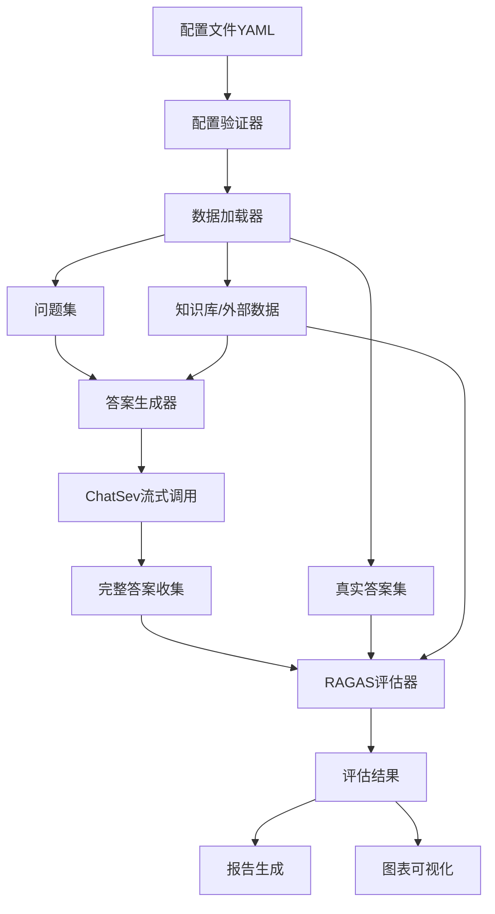

# RAG 评估系统技术实施方案

## 1. 项目概览

基于 RAGAS 0.3.5+构建可扩展的 RAG 评估体系，通过配置文件驱动，支持多种数据源，集成现有的 Knowledge.py 和 ChatSev 系统。

## 2. 系统架构设计

### 2.1 核心组件架构

```
evaluation/
├── core/                    # 核心评估模块
│   ├── __init__.py
│   ├── evaluator.py        # 主评估器
│   ├── answer_generator.py # 答案生成器
│   ├── data_loader.py      # 数据加载器
│   └── metrics_calculator.py # 指标计算器
├── config/                  # 配置管理
│   ├── __init__.py
│   ├── config_schema.py    # 配置模式定义
│   └── validator.py        # 配置验证器
├── examples/               # 示例数据
│   ├── sample_questions.json
│   ├── sample_ground_truths.json
│   └── sample_config.yaml
├── results/                # 评估结果存储
│   ├── reports/           # 评估报告
│   ├── charts/            # 可视化图表
│   └── exports/           # 导出数据
├── notebooks/             # Jupyter演示笔记本
│   └── demo_evaluation.ipynb
├── main.py                # 主执行脚本
└── README.md             # 使用说明
```

### 2.2 数据流设计



## 3. 详细技术设计

### 3.1 配置文件结构 (YAML)

```yaml
# evaluation_config.yaml
evaluation:
  # 项目元信息
  project_name: "RAG系统评估"
  description: "基于RAGAS的RAG系统性能评估"
  version: "1.0.0"

  # 数据源配置
  dataset:
    # 数据源类型: "file" 或 "knowledge_base"
    type: "file" # "knowledge_base"

    # 文件模式配置
    questions_path: "evaluation/examples/sample_questions.json"
    ground_truths_path: "evaluation/examples/sample_ground_truths.json"
    contexts_path: null # 可选，如果不提供则从知识库检索

    # 知识库模式配置（当type为knowledge_base时）
    knowledge_base:
      kb_id: "67fa7b1acaaf230867eefce1"
      search_k: 5
      filter_by_file_md5: null # 可选的文件过滤

  # LLM配置（用于答案生成）
  llm_config:
    supplier: "openai" # openai, siliconflow, volces, ollama, oneapi
    model: "deepseek-ai/DeepSeek-V3
    api_key: "your_api_key_here" # 或从环境变量读取
    temperature: 0.1

  # 知识检索配置
  knowledge_config:
    use_bm25: true
    bm25_k: 3
    # 重排序配置
    reranker_config:
      use_reranker: true
      reranker_type: "remote" # local, remote
      remote_rerank_config:
        api_key: "your_rerank_api_key"
        model: "BAAI/bge-reranker-v2-m3"
      rerank_top_n: 3

  # 评估指标配置
  metrics:
    - "ContextRelevance" # 上下文相关性
    - "ContextPrecision" # 上下文精确度
    - "ContextRecall" # 上下文召回率
    - "Faithfulness" # 忠实度
    - "AnswerRelevancy" # 答案相关性

  # 评估器配置
  evaluator_config:
    # 用于评估的LLM配置（可以与答案生成不同）
    judge_llm:
      supplier: "openai"
      model: "gpt-4"
      api_key: "your_judge_api_key"
      temperature: 0.0

  # 输出配置
  output:
    results_dir: "evaluation/results"
    export_format: ["json", "csv", "html"] # 支持的导出格式
    save_individual_scores: true
    generate_charts: true
```

### 3.2 数据格式规范

#### 3.2.1 Questions 格式 (JSON)

```json
{
  "questions": ["什么是RAG技术？", "如何评估RAG系统性能？"]
}
```

#### 3.2.2 Ground Truths 格式 (JSON)

```json
{
  "ground_truths": [
    [
      "RAG是检索增强生成技术，结合了信息检索和文本生成。",
      "它通过先检索相关文档，再生成答案来提高准确性。"
    ],
    ["RAG系统性能可以通过RAGAS框架评估，包括上下文相关性、忠实度等指标。"]
  ]
}
```

### 3.3 核心模块设计

#### 3.3.1 配置管理模块

```python
# config/config_schema.py
from dataclasses import dataclass
from typing import List, Optional, Dict, Any, Literal
import yaml

@dataclass
class LLMConfig:
    supplier: str
    model: str
    api_key: Optional[str] = None
    temperature: float = 0.1
    max_length: int = 2048

@dataclass
class RerankerConfig:
    use_reranker: bool = False
    reranker_type: Literal["local", "remote"] = "remote"
    remote_rerank_config: Optional[Dict[str, Any]] = None
    rerank_top_n: int = 3

@dataclass
class KnowledgeConfig:
    use_bm25: bool = False
    bm25_k: int = 3
    reranker_config: RerankerConfig = None

@dataclass
class DatasetConfig:
    type: Literal["file", "knowledge_base"]
    questions_path: Optional[str] = None
    ground_truths_path: Optional[str] = None
    contexts_path: Optional[str] = None
    knowledge_base: Optional[Dict[str, Any]] = None

@dataclass
class EvaluationConfig:
    project_name: str
    dataset: DatasetConfig
    llm_config: LLMConfig
    knowledge_config: Optional[KnowledgeConfig]
    metrics: List[str]
    evaluator_config: Dict[str, Any]
    output: Dict[str, Any]

def load_config(config_path: str) -> EvaluationConfig:
    """从YAML文件加载配置"""
    with open(config_path, 'r', encoding='utf-8') as f:
        config_dict = yaml.safe_load(f)

    # 配置验证和转换逻辑
    return EvaluationConfig(**config_dict['evaluation'])
```

#### 3.3.2 数据加载模块

```python
# core/data_loader.py
import json
from typing import List, Tuple, Optional
from dataclasses import dataclass

@dataclass
class EvaluationDataset:
    questions: List[str]
    ground_truths: List[List[str]]
    contexts: Optional[List[List[str]]] = None

class DataLoader:
    """统一的数据加载器"""

    def __init__(self, config: DatasetConfig):
        self.config = config

    async def load_dataset(self) -> EvaluationDataset:
        """根据配置加载数据集"""
        if self.config.type == "file":
            return await self._load_from_files()
        elif self.config.type == "knowledge_base":
            return await self._load_from_knowledge_base()
        else:
            raise ValueError(f"不支持的数据源类型: {self.config.type}")

    async def _load_from_files(self) -> EvaluationDataset:
        """从文件加载数据"""
        # 加载问题
        with open(self.config.questions_path, 'r', encoding='utf-8') as f:
            questions_data = json.load(f)
        questions = questions_data.get('questions', [])

        # 加载真实答案
        with open(self.config.ground_truths_path, 'r', encoding='utf-8') as f:
            gt_data = json.load(f)
        ground_truths = gt_data.get('ground_truths', [])

        # 可选：加载上下文
        contexts = None
        if self.config.contexts_path:
            with open(self.config.contexts_path, 'r', encoding='utf-8') as f:
                contexts_data = json.load(f)
            contexts = contexts_data.get('contexts', [])

        return EvaluationDataset(
            questions=questions,
            ground_truths=ground_truths,
            contexts=contexts
        )

    async def _load_from_knowledge_base(self) -> EvaluationDataset:
        """从知识库加载数据（需要实现具体逻辑）"""
        # 这里需要集成Knowledge.py的逻辑
        pass
```

#### 3.3.3 答案生成模块

```python
# core/answer_generator.py
import asyncio
import json
import logging
from typing import List, AsyncIterator
from src.service.ChatSev import ChatSev
from src.utils.Knowledge import Knowledge
from src.utils.llm_modle import get_llms

class AnswerGenerator:
    """RAG答案生成器，集成ChatSev和Knowledge"""

    def __init__(self, config: EvaluationConfig):
        self.config = config
        self.knowledge = None
        self.chat_service = None

    async def initialize(self):
        """初始化知识库和聊天服务"""
        if self.config.dataset.type == "knowledge_base":
            # 初始化Knowledge实例
            # 这里需要根据实际情况获取embedding
            self.knowledge = Knowledge(
                _embeddings=None,  # 需要根据配置获取
                splitter="hybrid",
                use_bm25=self.config.knowledge_config.use_bm25,
                bm25_k=self.config.knowledge_config.bm25_k,
                use_reranker=self.config.knowledge_config.reranker_config.use_reranker,
                reranker_type=self.config.knowledge_config.reranker_config.reranker_type,
                remote_rerank_config=self.config.knowledge_config.reranker_config.remote_rerank_config,
                rerank_top_n=self.config.knowledge_config.reranker_config.rerank_top_n,
            )

        # 初始化ChatSev
        self.chat_service = ChatSev(knowledge=self.knowledge)

    async def generate_answers(self, questions: List[str]) -> List[str]:
        """为问题列表生成答案"""
        answers = []

        for i, question in enumerate(questions):
            logging.info(f"正在生成第 {i+1}/{len(questions)} 个答案: {question[:50]}...")

            try:
                answer = await self._generate_single_answer(question)
                answers.append(answer)
                logging.info(f"答案生成完成 ({i+1}/{len(questions)})")
            except Exception as e:
                logging.error(f"生成答案失败 {question}: {e}")
                answers.append(f"生成失败: {str(e)}")

        return answers

    async def _generate_single_answer(self, question: str) -> str:
        """生成单个问题的答案"""
        # 收集流式响应
        full_answer = ""

        async for chunk_dict in self.chat_service.stream_chat(
            question=question,
            api_key=self.config.llm_config.api_key,
            supplier=self.config.llm_config.supplier,
            model=self.config.llm_config.model,
            session_id="evaluation_session",
            knowledge_base_id=self.config.dataset.knowledge_base.get("kb_id") if self.config.dataset.knowledge_base else None,
            search_k=self.config.dataset.knowledge_base.get("search_k", 3) if self.config.dataset.knowledge_base else 3,
            temperature=self.config.llm_config.temperature,
        ):
            if chunk_dict.get("type") == "chunk":
                full_answer += chunk_dict.get("data", "")

        return full_answer.strip()

    async def get_contexts_for_questions(self, questions: List[str]) -> List[List[str]]:
        """为问题列表获取检索上下文"""
        if not self.knowledge:
            return [[] for _ in questions]

        contexts = []
        kb_id = self.config.dataset.knowledge_base.get("kb_id")

        for question in questions:
            try:
                documents = await self.knowledge.retrieve_documents(kb_id, question)
                context_list = [doc.page_content for doc in documents]
                contexts.append(context_list)
            except Exception as e:
                logging.error(f"检索上下文失败 {question}: {e}")
                contexts.append([])

        return contexts
```

#### 3.3.4 评估器模块

```python
# core/evaluator.py
import asyncio
import pandas as pd
from typing import List, Dict, Any
from ragas import evaluate
from ragas.metrics import (
    ContextRelevance,     # 新版本API
    ContextPrecision,
    ContextRecall,
    Faithfulness,
    AnswerRelevancy
)
from datasets import Dataset

class RAGASEvaluator:
    """RAGAS评估器，使用0.3.5+版本API"""

    # 指标映射
    METRICS_MAP = {
        "ContextRelevance": ContextRelevance(),
        "ContextPrecision": ContextPrecision(),
        "ContextRecall": ContextRecall(),
        "Faithfulness": Faithfulness(),
        "AnswerRelevancy": AnswerRelevancy(),
    }

    def __init__(self, config: EvaluationConfig):
        self.config = config
        self.selected_metrics = [
            self.METRICS_MAP[metric_name]
            for metric_name in config.metrics
            if metric_name in self.METRICS_MAP
        ]

    async def evaluate(
        self,
        questions: List[str],
        answers: List[str],
        contexts: List[List[str]],
        ground_truths: List[List[str]]
    ) -> Dict[str, Any]:
        """执行RAGAS评估"""

        # 构建RAGAS数据集
        dataset_dict = {
            "question": questions,
            "answer": answers,
            "contexts": contexts,
            "ground_truth": ground_truths
        }

        dataset = Dataset.from_dict(dataset_dict)

        # 执行评估
        try:
            result = evaluate(dataset=dataset, metrics=self.selected_metrics)
            return self._process_results(result)
        except Exception as e:
            logging.error(f"RAGAS评估失败: {e}")
            raise

    def _process_results(self, ragas_result) -> Dict[str, Any]:
        """处理RAGAS评估结果"""
        # 提取总体分数
        overall_scores = {}
        for metric_name in self.config.metrics:
            if metric_name.lower() in ragas_result:
                overall_scores[metric_name] = ragas_result[metric_name.lower()]

        # 转换为DataFrame以便后续处理
        df = ragas_result.to_pandas()

        return {
            "overall_scores": overall_scores,
            "detailed_results": df,
            "summary": self._generate_summary(overall_scores)
        }

    def _generate_summary(self, scores: Dict[str, float]) -> Dict[str, Any]:
        """生成评估摘要"""
        return {
            "average_score": sum(scores.values()) / len(scores) if scores else 0,
            "best_metric": max(scores.items(), key=lambda x: x[1]) if scores else None,
            "worst_metric": min(scores.items(), key=lambda x: x[1]) if scores else None,
            "total_metrics": len(scores)
        }
```

#### 3.3.5 主评估流程

```python
# core/main_evaluator.py
import asyncio
import logging
from datetime import datetime
from pathlib import Path

class MainEvaluator:
    """主评估流程协调器"""

    def __init__(self, config: EvaluationConfig):
        self.config = config
        self.data_loader = DataLoader(config.dataset)
        self.answer_generator = AnswerGenerator(config)
        self.evaluator = RAGASEvaluator(config)

    async def run_evaluation(self) -> Dict[str, Any]:
        """运行完整的评估流程"""
        logging.info("开始RAG评估流程...")

        # 1. 初始化组件
        await self.answer_generator.initialize()

        # 2. 加载数据集
        logging.info("加载数据集...")
        dataset = await self.data_loader.load_dataset()

        # 3. 生成答案
        logging.info("生成答案...")
        answers = await self.answer_generator.generate_answers(dataset.questions)

        # 4. 获取上下文（如果需要）
        if dataset.contexts is None:
            logging.info("获取检索上下文...")
            contexts = await self.answer_generator.get_contexts_for_questions(dataset.questions)
        else:
            contexts = dataset.contexts

        # 5. 执行评估
        logging.info("执行RAGAS评估...")
        results = await self.evaluator.evaluate(
            questions=dataset.questions,
            answers=answers,
            contexts=contexts,
            ground_truths=dataset.ground_truths
        )

        # 6. 保存结果
        await self._save_results(results, dataset, answers, contexts)

        logging.info("评估完成！")
        return results

    async def _save_results(self, results, dataset, answers, contexts):
        """保存评估结果"""
        timestamp = datetime.now().strftime("%Y%m%d_%H%M%S")
        results_dir = Path(self.config.output["results_dir"])
        results_dir.mkdir(parents=True, exist_ok=True)

        # 保存详细结果
        if "json" in self.config.output["export_format"]:
            results_file = results_dir / f"evaluation_results_{timestamp}.json"
            with open(results_file, 'w', encoding='utf-8') as f:
                json.dump(results, f, ensure_ascii=False, indent=2, default=str)

        # 保存CSV
        if "csv" in self.config.output["export_format"]:
            csv_file = results_dir / f"evaluation_results_{timestamp}.csv"
            results["detailed_results"].to_csv(csv_file, index=False)

        logging.info(f"结果已保存到: {results_dir}")
```

### 3.4 主执行脚本

```python
# main.py
import asyncio
import logging
import argparse
from pathlib import Path
from config.config_schema import load_config
from core.main_evaluator import MainEvaluator

def setup_logging(level=logging.INFO):
    """设置日志"""
    logging.basicConfig(
        level=level,
        format='%(asctime)s - %(name)s - %(levelname)s - %(message)s',
        handlers=[
            logging.FileHandler('evaluation.log'),
            logging.StreamHandler()
        ]
    )

async def main():
    """主函数"""
    parser = argparse.ArgumentParser(description="RAG系统评估工具")
    parser.add_argument(
        "--config",
        type=str,
        default="evaluation/examples/sample_config.yaml",
        help="配置文件路径"
    )
    parser.add_argument(
        "--verbose",
        action="store_true",
        help="详细日志输出"
    )

    args = parser.parse_args()

    # 设置日志
    log_level = logging.DEBUG if args.verbose else logging.INFO
    setup_logging(log_level)

    try:
        # 加载配置
        config = load_config(args.config)
        logging.info(f"配置加载成功: {config.project_name}")

        # 创建评估器
        evaluator = MainEvaluator(config)

        # 运行评估
        results = await evaluator.run_evaluation()

        # 输出摘要
        print("\n" + "="*50)
        print("评估完成！")
        print("="*50)
        print(f"项目: {config.project_name}")
        print(f"平均分数: {results['summary']['average_score']:.4f}")
        print(f"最佳指标: {results['summary']['best_metric'][0]} ({results['summary']['best_metric'][1]:.4f})")
        print(f"最差指标: {results['summary']['worst_metric'][0]} ({results['summary']['worst_metric'][1]:.4f})")
        print("="*50)

    except Exception as e:
        logging.error(f"评估过程中发生错误: {e}", exc_info=True)
        return 1

    return 0

if __name__ == "__main__":
    exit(asyncio.run(main()))
```

## 4. 实施步骤

### 阶段一：基础架构搭建（1-2 天）

1. 创建项目目录结构
2. 实现配置管理模块
3. 创建数据加载器基础框架
4. 设置日志和错误处理

### 阶段二：核心功能实现（2-3 天）

1. 集成 ChatSev 答案生成
2. 实现 RAGAS 0.3.5 评估器
3. 完成数据流处理逻辑
4. 实现结果保存和导出

### 阶段三：测试和完善（1-2 天）

1. 创建测试用例
2. 验证与现有系统的集成
3. 性能优化和错误处理
4. 编写使用文档

### 阶段四：文档和示例（1 天）

1. 完善 README 文档
2. 创建配置示例
3. 编写 Jupyter 演示笔记本
4. 准备部署指南

## 5. 关键技术挑战和解决方案

### 5.1 流式响应收集

**挑战**: ChatSev 返回流式响应，需要完整收集
**解决方案**: 异步收集所有 chunk，组装完整答案

### 5.2 RAGAS 版本兼容性

**挑战**: 新版本 API 变化较大
**解决方案**: 使用最新的 metrics 导入方式，确保兼容性

### 5.3 性能优化

**挑战**: 大量问题的答案生成耗时长
**解决方案**:

- 支持批量并发处理
- 进度显示和中断恢复
- 结果缓存机制

### 5.4 错误处理

**挑战**: 各环节可能出现异常
**解决方案**: 完善的异常处理和日志记录

## 6. 扩展功能规划

1. **可视化报告**: 使用 matplotlib/plotly 生成图表
2. **对比评估**: 支持多个模型/配置的对比
3. **增量评估**: 支持新增数据的增量评估
4. **API 接口**: 提供 RESTful API 供其他系统调用
5. **实时监控**: 支持生产环境的实时评估监控

## 补充

在脚本中添加以下 env 加载代码，包含了这包含了 MONGODB_URL、MONGO_DB_NAME、MONGODB_COLLECTION_NAME_CHATHISTORY、ONEAPI_BASE_URL、ONEAPI_API_KEY、SILICONFLOW_API_KEY 等等项目运行所需要的全部环境变量。

```python
from dotenv import load_dotenv
logger = setup_development_logging(log_dir="./log")
load_dotenv()  # 加载 .env 基础配置
logger.info("APP_ENV: .env")
load_dotenv(dotenv_path=".env.dev", override=True)
logger.info("APP_ENV: .env.dev")
```

这个技术方案为后续开发提供了详细的路线图，确保系统的可扩展性、可维护性和易用性。

以上就是完整的技术实施方案。这个方案考虑了您的所有需求，提供了：

1. **清晰的架构设计** - 模块化、可扩展的系统架构
2. **详细的技术规范** - 配置文件格式、数据流设计、核心模块实现
3. **完整的实施路径** - 分阶段的开发计划和关键技术挑战解决方案
4. **未来扩展考虑** - 为后续功能增强预留空间

我建议按照实施步骤逐步进行：

1. 先搭建基础架构
2. 然后实现核心功能
3. 最后完善测试和文档
